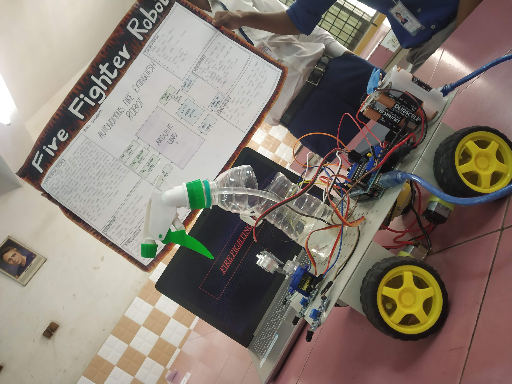

# Automatic-Fire-Fighting-Robot-And-Bluetooth-Pairing
This advanced firefighting robotic system independently detects and extinguishes fire. In the age of technology, the world is slowly turning towards the automated system and self-travelling vehicles, fire fighters are constantly at a risk of losing their life. Fire spreads rapidly if it is not controlled. In case of a gas leakage there even may be an explosion. So, in order to overcome this issue, safe guard live of our hero, our system comes to the rescue. This firefighting robotic system is powered by Arduino Uno development board it consists of the HC-SR04 ultra-sonic sensor mounted on a servo motor for obstacles detection and free path navigation, it is also equipped with the fire flame sensor for detecting and approaching fire it also makes use of water tank and spray mechanism for extinguishing the fire. Water spraying nozzle is mounted on servo motor to cover maximum area. Water is pumped from the main water tank to the water nozzle with the help of 12V pump. This water pump needs driver circuit as it consumes a lot of current, much more than the controller provides.

